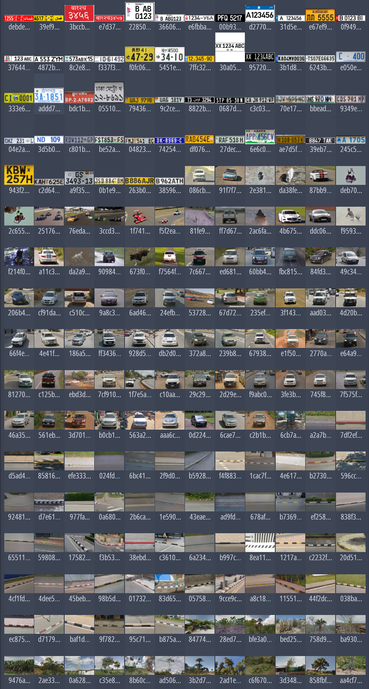

По факту это сборщик и просмоторщик данных для самостоятельного заполнения базы. Но я собрал ручки, чтобы агенты смогли сами искать информацию в интернете и заполнять ее. Я пару сайтов так прогнал и собрал базу с ассетами.

Она отдельно в релизах лежит, ее вместе с ассетами надо положить в 

'%AppData%\Roaming\com.wismut.guess-map'

В базе куча примеров картинок, поэтому она столько вестит

